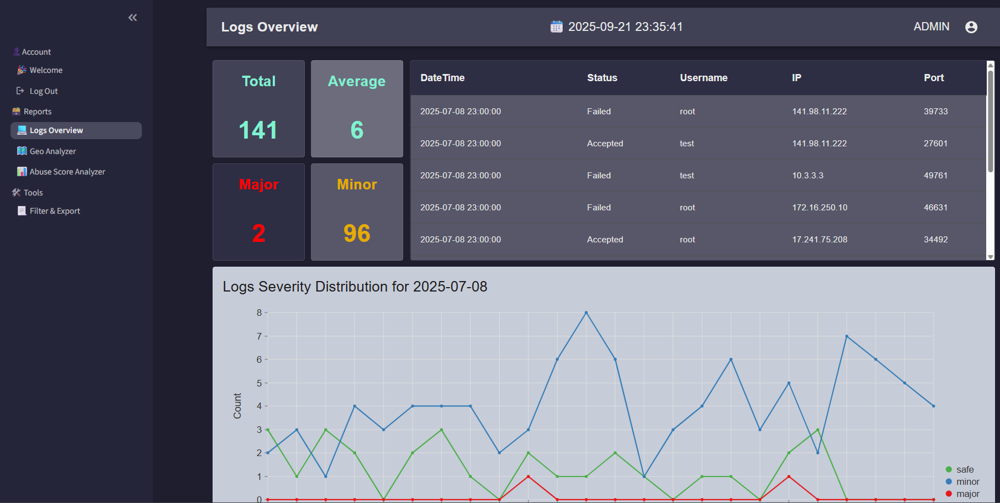

# **SSH Log Threat Detection Tool (Python + Streamlit)**

A Python + Streamlit dashboard that simulates SSH log analysis, detects suspicious login activity, and visualizes attack patterns with interactive charts.
It simulates and processes SSH log data, flags potentially malicious IPs using behavior thresholds, enriches intelligence with IPInfo and AbuseIPDB APIs, and visualizes attack patterns with interactive charts.

Built with Python, Streamlit, pandas, and Nivo charts, designed to be modular and extensible for further threat detection use cases.

## Features
- Detect brute-force login attempts
- Enrich IP data with IPInfo & AbuseIPDB
- Explore results via an interactive Streamlit dashboard
- Export filtered logs to CSV for further analysis

## Installation
```bash
git clone https://github.com/your-username/ssh-log-threat-detection.git
cd ssh-log-threat-detection
pip install -r requirements.txt
```

## Usage
```bash
streamlit run app.py
```
## Example Dashboard
Here's a preview of the dashboard:


## Tech Stack
- Python 3.9+
- Streamlit (UI & interactive dashboard)
- pandas (log parsing & analysis)
- AgGrid (interactive tables)
- Nivo (via streamlit-elements) (charts & graphs)
- IPInfo / AbuseIPDB APIs (threat intelligence enrichment)

## License
This project is licensed under the MIT License.
